# Mermaid チートシート

[Mermaid](https://github.com/mermaid-js/mermaid) の日本語チートシートです。

GitHub の Markdown のコードブロックで Mermaid シンタックスが使えるようになりました。

- [Include diagrams in your Markdown files with Mermaid | The GitHub Blog](https://github.blog/2022-02-14-include-diagrams-markdown-files-mermaid/)

## 公式 README のサンプル

- [フローチャート](#フローチャート)
- [シーケンス図](#シーケンス図)
- [ガントチャート](#ガントチャート)
- [クラス図](#クラス図)
- [状態図](#状態図)
- [パイチャート（円グラフ）](#パイチャート円グラフ)
- [Git グラフ](#git-グラフ)
- [ユーザージャーニー図](#ユーザージャーニー図)

### フローチャート

```
flowchart LR
A[ハード] -->|テキスト| B(ラウンド)
B --> C{判断}
C -->|1| D[結果 1]
C -->|2| E[結果 2]
```

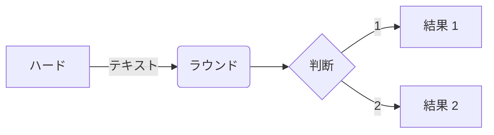

### シーケンス図

```
sequenceDiagram
アリス->>ジョン: やぁ、ジョン、調子はどう？
loop ヘルスチェック
    ジョン->>ジョン: 心気症との闘い
end
Note right of ジョン: 合理的な思考
ジョン-->>アリス: いいよ！
ジョン->>ボブ: 調子はどう？
ボブ-->>ジョン: ばっちりよ！
```

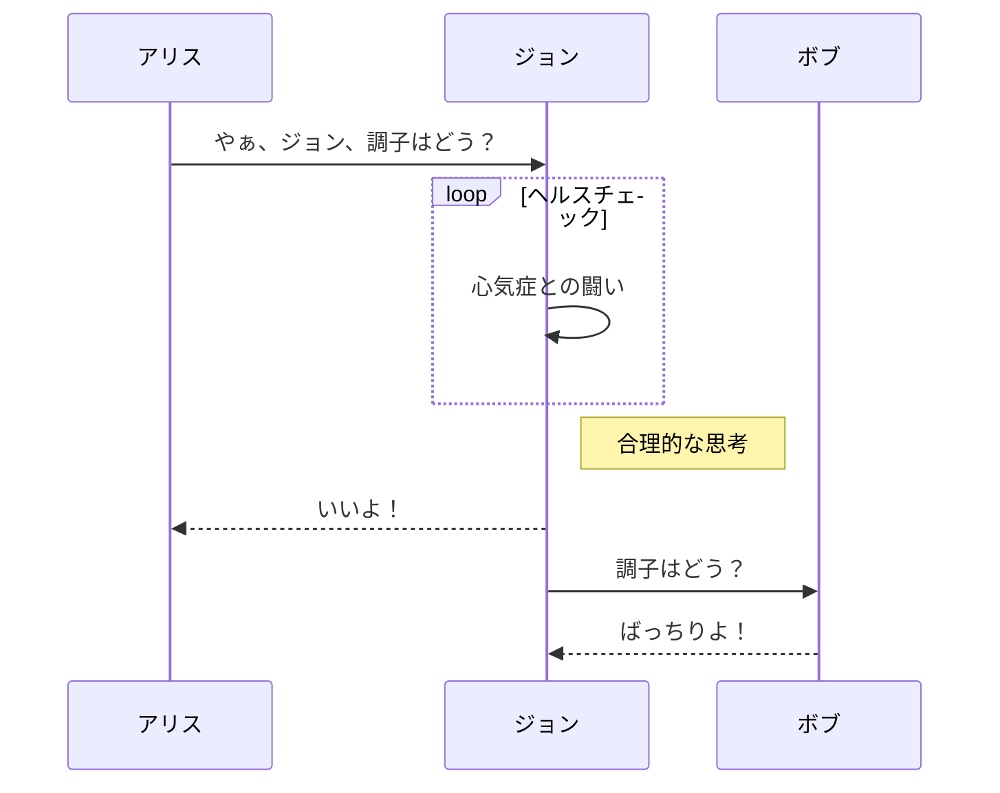

### ガントチャート

```
gantt
    section セクション
    完了 :done,    des1, 2014-01-06,2014-01-08
    アクティブ        :active,  des2, 2014-01-07, 3d
    並行 1   :         des3, after des1, 1d
    並行 2   :         des4, after des1, 1d
    並行 3   :         des5, after des3, 1d
    並行 4   :         des6, after des4, 1d
```

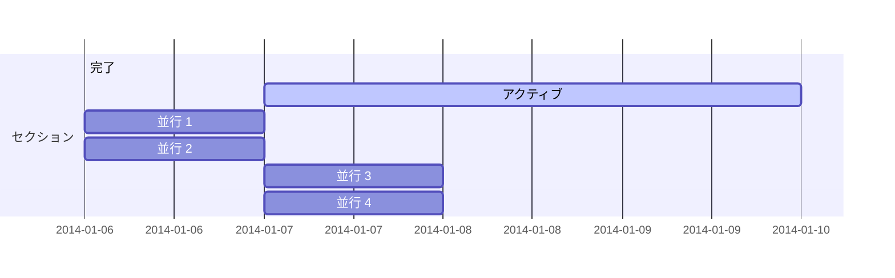

### クラス図

```
classDiagram
クラス01 <|-- 長ーいクラス : イケてる
<<Interface>> クラス01
クラス09 --> C2 : ここはどこ？
クラス09 --* C3
クラス09 --|> クラス07
クラス07 : equals()
クラス07 : Object[] elementData
クラス01 : size()
クラス01 : int chimp
クラス01 : int gorilla
class クラス10 {
  <<service>>
  int id
  size()
}
```

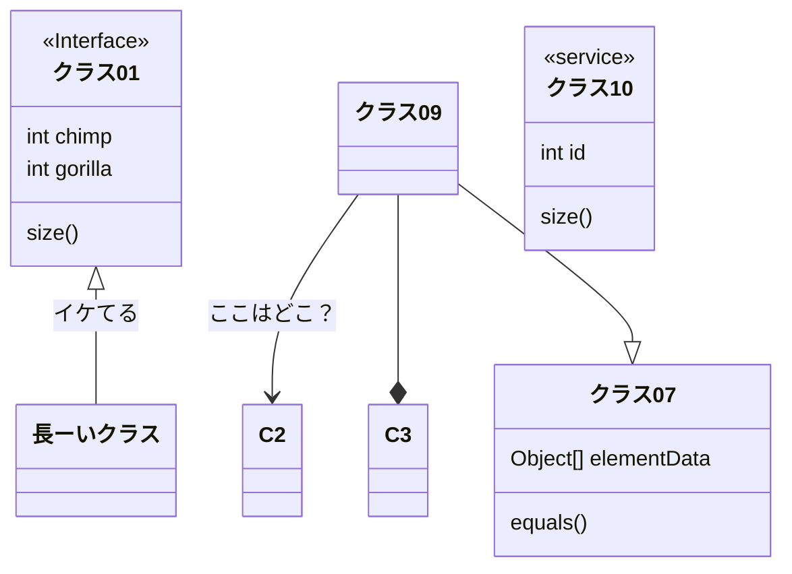

### 状態図

```
stateDiagram-v2
[*] --> 停止
停止 --> [*]
停止 --> 移動
移動 --> 停止
移動 --> 衝突
衝突 --> [*]
```

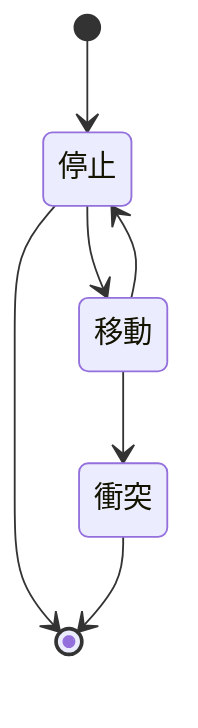

### パイチャート（円グラフ）

```
pie
"犬" : 386
"猫" : 85
"ネズミ" : 15
```

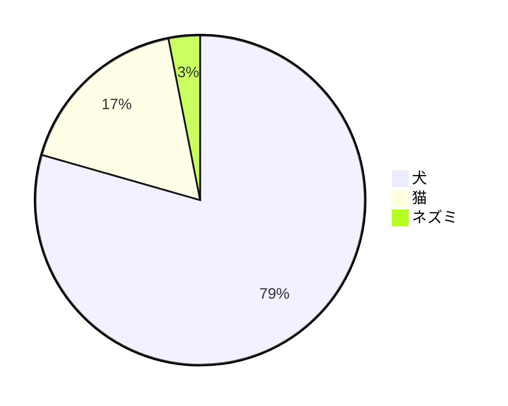

### Git グラフ

```
gitGraph
   commit id: "Alpha"
   commit id: "Beta"
   commit id: "Gamma"
```

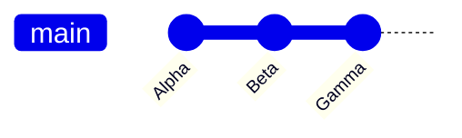

### ユーザージャーニー図

```
  journey
    title 私の勤務日
    section 出勤
      お茶をいれる: 5: 私
      上の階にのぼる: 3: 私
      働く: 1: 私, 猫
    section 退勤
      下の階におりる: 5: 私
      座る: 3: 私
```

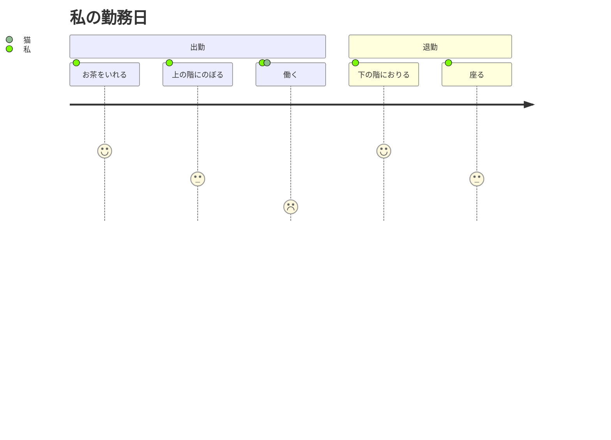

## REAMDE にサンプルの無いもの

- [ER 図](#er-図)
- [要件図](#要件図)

### ER 図

```
erDiagram
    CUSTOMER ||--o{ ORDER : "入れる"
    ORDER ||--|{ LINE-ITEM : "含む"
    CUSTOMER }|..|{ DELIVERY-ADDRESS : "使う"
```

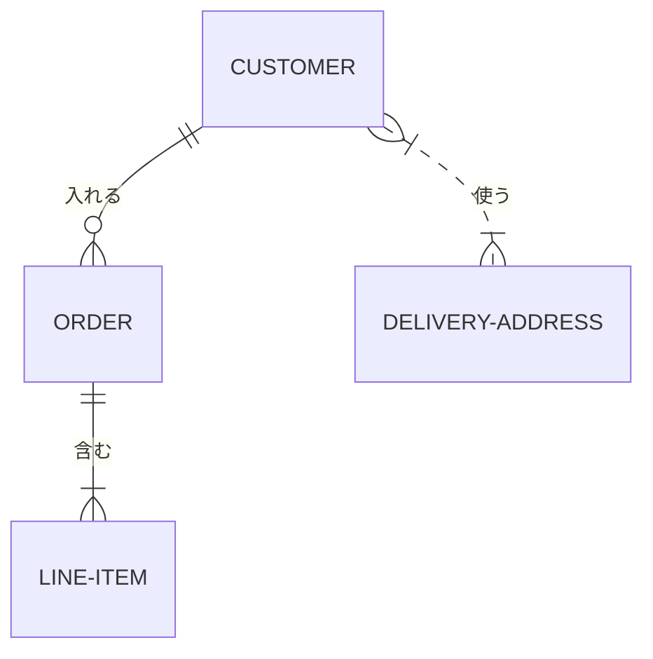

```
erDiagram
    CUSTOMER ||--o{ ORDER : "入れる"
    CUSTOMER {
        string name
        string custNumber
        string sector
    }
    ORDER ||--|{ LINE-ITEM : "含む"
    ORDER {
        int orderNumber
        string deliveryAddress
    }
    LINE-ITEM {
        string productCode
        int quantity
        float pricePerUnit
    }
```

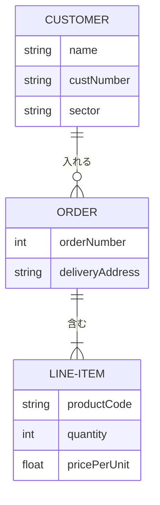

複雑なサンプル:

```
erDiagram
    CAR ||--o{ NAMED-DRIVER : "許可する"
    CAR {
        string allowedDriver FK "許可されたドライバーのライセンス"
        string registrationNumber
        string make
        string model
    }
    PERSON ||--o{ NAMED-DRIVER : "である"
    PERSON {
        string driversLicense PK "ライセンスナンバー"
        string firstName
        string lastName
        int age
    }
```

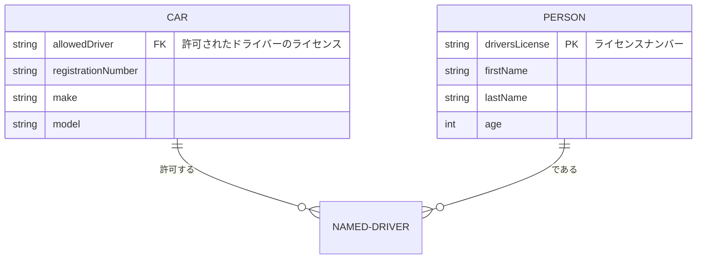

※要素を日本語に変えると描画に失敗するため英語のまま

- [Entity Relationship Diagram | mermaid](https://mermaid-js.github.io/mermaid/#/entityRelationshipDiagram)

### 要件図

```
    requirementDiagram

    requirement "テスト要件" {
    id: 1
    text: テストテキスト。
    risk: high
    verifymethod: test
    }

    element "テストエンティティ" {
    type: simulation
    }

    "テストエンティティ" - satisfies -> "テスト要件"
```

```mermaid
    requirementDiagram

    requirement "テスト要件" {
    id: 1
    text: テストテキスト。
    risk: high
    verifymethod: test
    }

    element "テストエンティティ" {
    type: simulation
    }

    "テストエンティティ" - satisfies -> "テスト要件"
```

※要素を日本語に変えると描画に失敗するため英語のまま

- [Requirement Diagram | mermaid](https://mermaid-js.github.io/mermaid/#/requirementDiagram)

## Mermaid 公式

- [リポジトリ](https://github.com/mermaid-js/mermaid)
- [ドキュメント](https://mermaid-js.github.io/mermaid/#/)
- [ライブエディタ](https://mermaid-js.github.io/mermaid-live-editor/)
