# Mermaid チートシート

[Mermaid](https://github.com/mermaid-js/mermaid) の日本語チートシートです。

GitHub の Markdown のコードブロックで Mermaid シンタックスが使えるようになりました。

- [Include diagrams in your Markdown files with Mermaid | The GitHub Blog](https://github.blog/2022-02-14-include-diagrams-markdown-files-mermaid/)

## 公式 README のサンプル

- [フローチャート](#フローチャート)
- [シーケンス図](#シーケンス図)
- [ガントチャート](#ガントチャート)
- [クラス図](#クラス図)
- [状態図](#状態図)
- [パイチャート（円グラフ）](#パイチャート円グラフ)
- [Git グラフ](#git-グラフ)
- [ユーザージャーニー図](#ユーザージャーニー図)

### フローチャート

```
flowchart LR
    A[ハード] -->|テキスト| B(ラウンド)
    B --> C{判断}
    C -->|1| D[結果 1]
    C -->|2| E[結果 2]
```

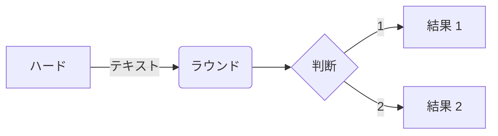

- [Flowchart | mermaid](https://mermaid-js.github.io/mermaid/#/flowchart)

### シーケンス図

```
sequenceDiagram
    アリス->>ジョン: やぁ、ジョン、調子はどう？
    loop ヘルスチェック
        ジョン->>ジョン: 心気症との闘い
    end
    Note right of ジョン: 合理的な思考
    ジョン-->>アリス: いいよ！
    ジョン->>ボブ: 調子はどう？
    ボブ-->>ジョン: ばっちりよ！
```

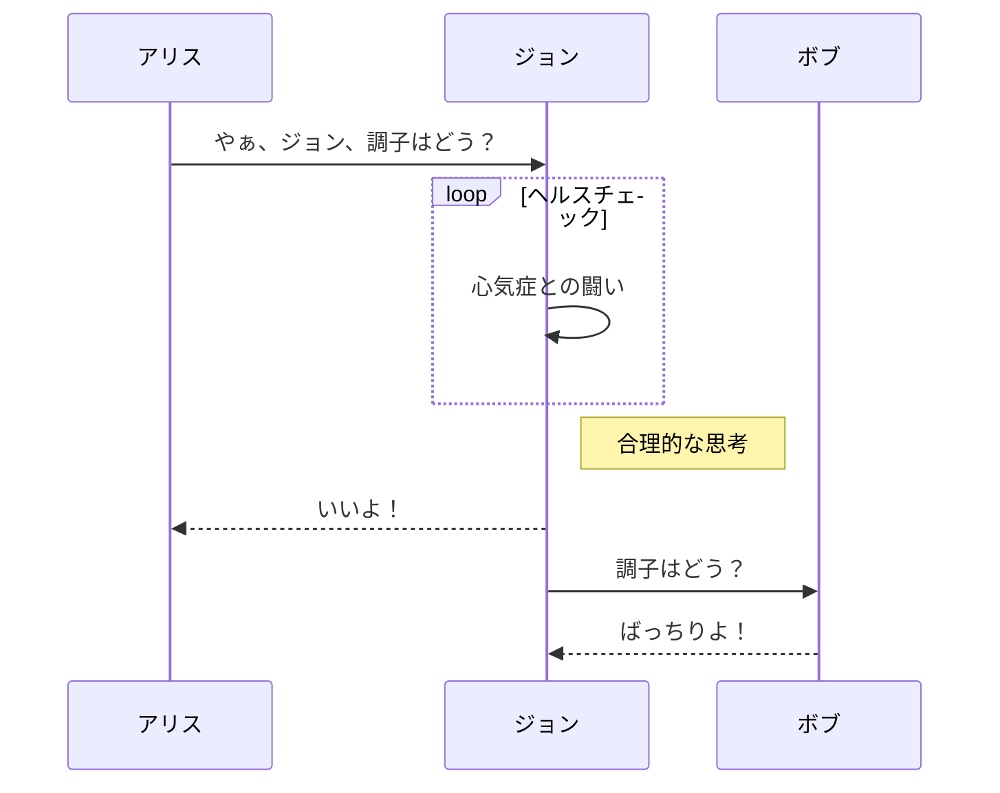

- [Sequence diagram | mermaid](https://mermaid-js.github.io/mermaid/#/sequenceDiagram)

### ガントチャート

```
gantt
    dateFormat  YYYY-MM-DD
    title GANNT チャートを mermaid に追加
    excludes weekdays 2014-01-10

    section セクション
    完了タスク            :done,    des1, 2014-01-06,2014-01-08
    アクティブタスク               :active,  des2, 2014-01-09, 3d
    未来のタスク               :         des3, after des2, 5d
    未来のタスク 2               :         des4, after des3, 5d
```

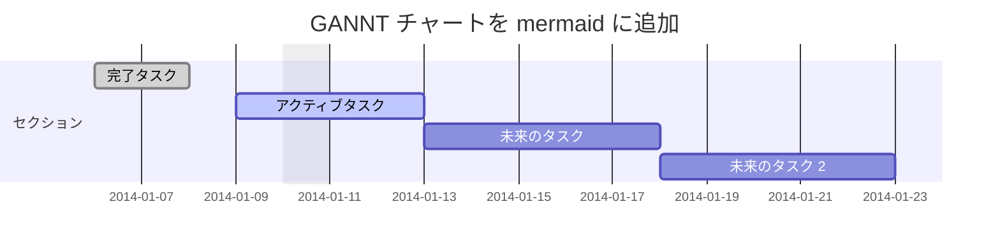

- [Gantt | mermaid](https://mermaid-js.github.io/mermaid/#/gantt)

### クラス図

```
classDiagram
    Animal <|-- Duck
    Animal <|-- Fish
    Animal <|-- Zebra
    Animal : +int age
    Animal : +String gender
    Animal: +isMammal()
    Animal: +mate()
    class Duck {
        +String beakColor
        +swim()
        +quack()
    }
    class Fish {
        -int sizeInFeet
        -canEat()
    }
    class Zebra {
        +bool is_wild
        +run()
    }
```

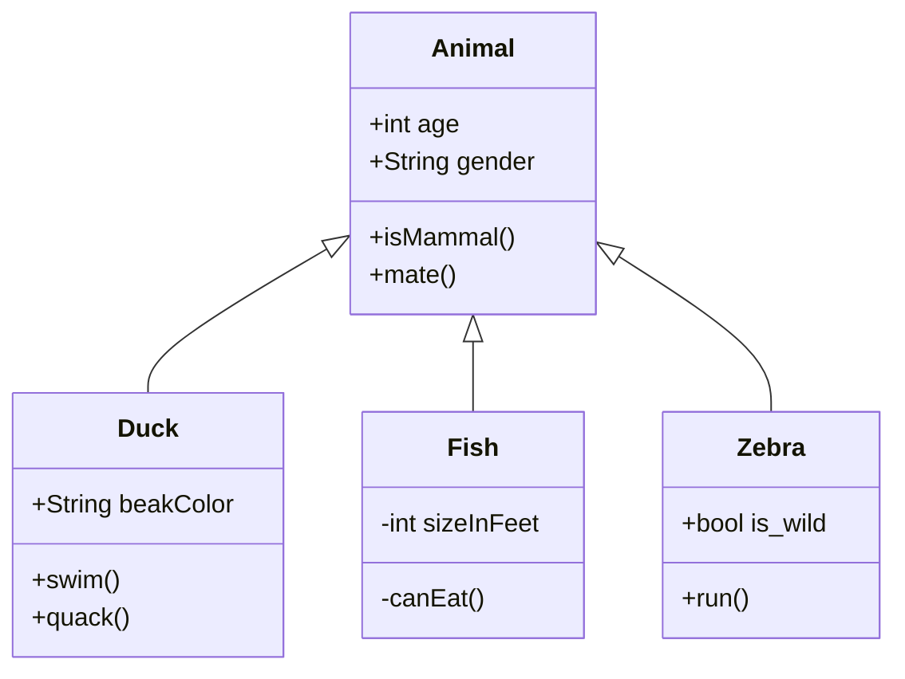

### 状態図

```
stateDiagram-v2
    [*] --> 停止
    停止 --> [*]
    停止 --> 移動
    移動 --> 停止
    移動 --> 衝突
    衝突 --> [*]
```

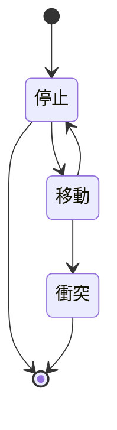

### パイチャート（円グラフ）

```
pie title ボランティアに迎えられたペット
    "犬" : 386
    "猫" : 85
    "ねずみ" : 15
```

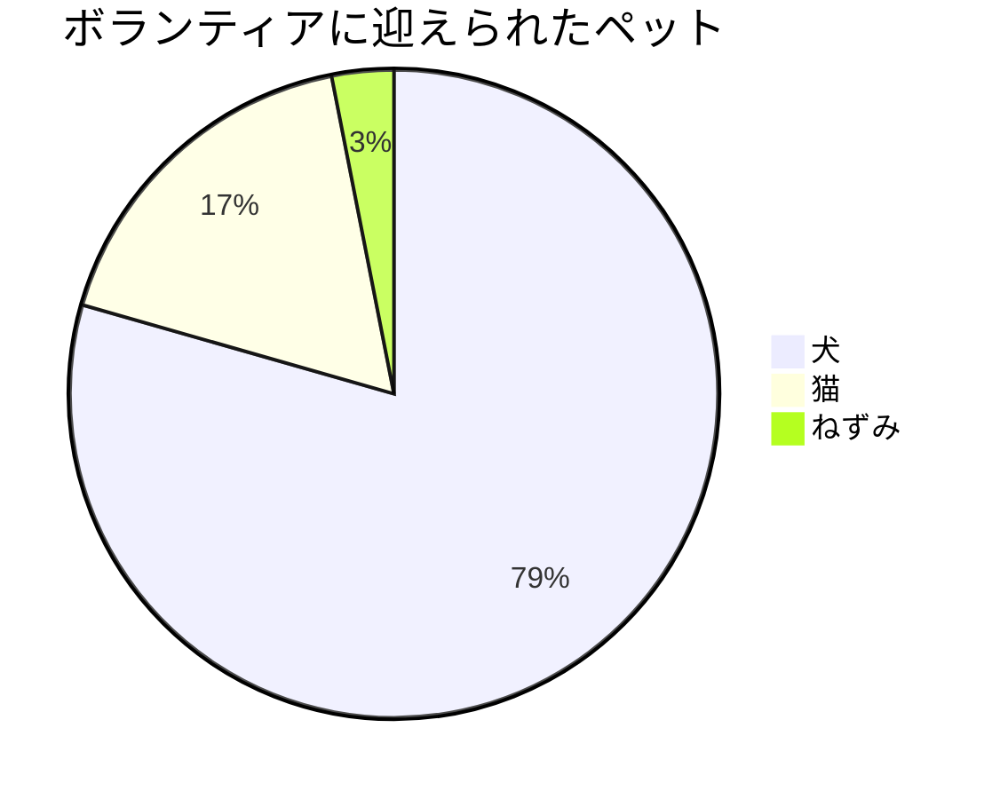

### Git グラフ

```
gitGraph
   commit
   commit tag: "v1.0.0"
   branch develop
   commit
   commit
   commit
   checkout main
   commit
   commit
   ```

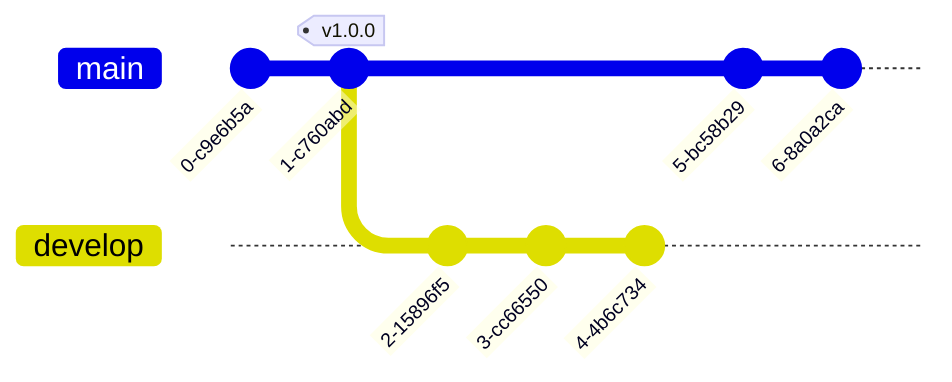

### ユーザージャーニー図

```
journey
    title 私の勤務日
    section 出勤
      お茶をいれる: 5: 私
      上の階にのぼる: 3: 私
      働く: 1: 私, 猫
    section 退勤
      下の階におりる: 5: 私
      座る: 3: 私
```

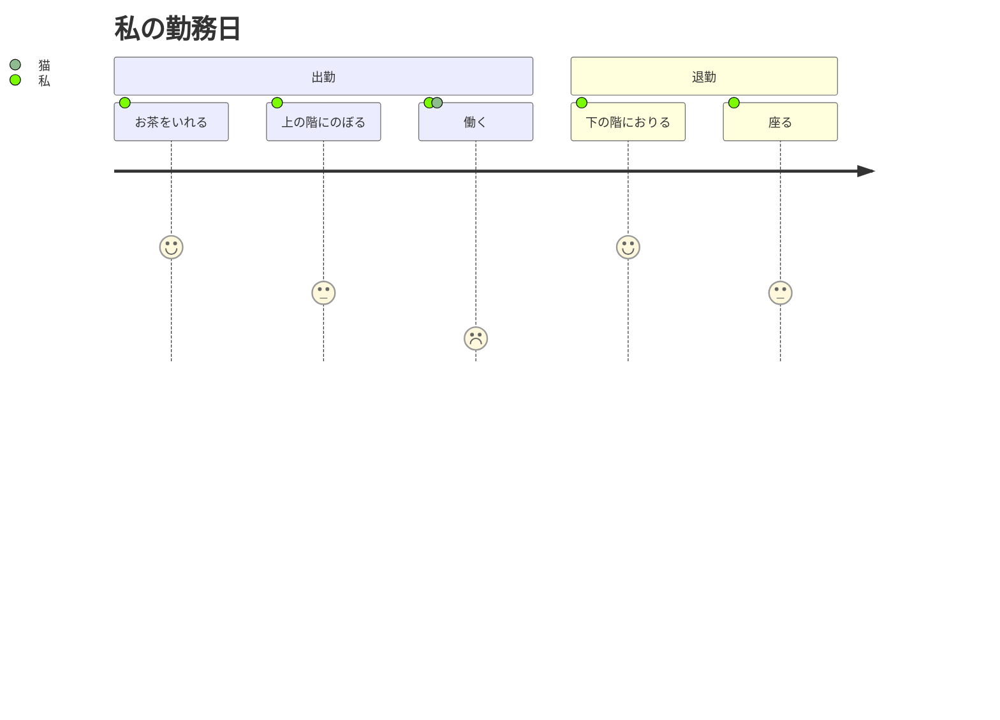

## REAMDE にサンプルの無いもの

- [ER 図](#er-図)
- [要件図](#要件図)

### ER 図

```
erDiagram
    CUSTOMER ||--o{ ORDER : "入れる"
    ORDER ||--|{ LINE-ITEM : "含む"
    CUSTOMER }|..|{ DELIVERY-ADDRESS : "使う"
```

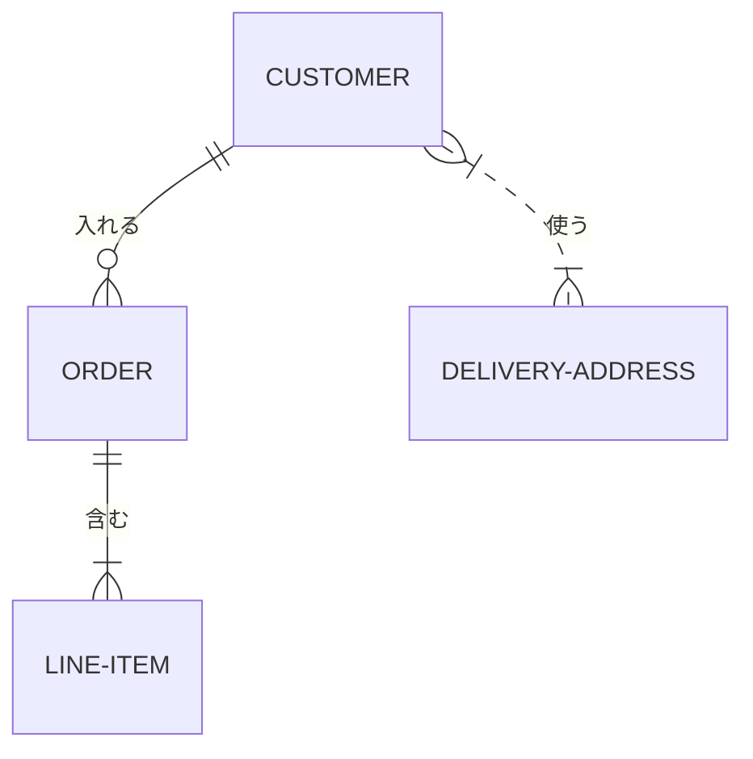

```
erDiagram
    CUSTOMER ||--o{ ORDER : "入れる"
    CUSTOMER {
        string name
        string custNumber
        string sector
    }
    ORDER ||--|{ LINE-ITEM : "含む"
    ORDER {
        int orderNumber
        string deliveryAddress
    }
    LINE-ITEM {
        string productCode
        int quantity
        float pricePerUnit
    }
```

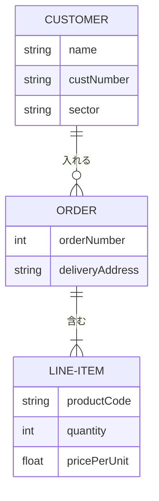

複雑なサンプル:

```
erDiagram
    CAR ||--o{ NAMED-DRIVER : "許可する"
    CAR {
        string allowedDriver FK "許可されたドライバーのライセンス"
        string registrationNumber
        string make
        string model
    }
    PERSON ||--o{ NAMED-DRIVER : "である"
    PERSON {
        string driversLicense PK "ライセンスナンバー"
        string firstName
        string lastName
        int age
    }
```

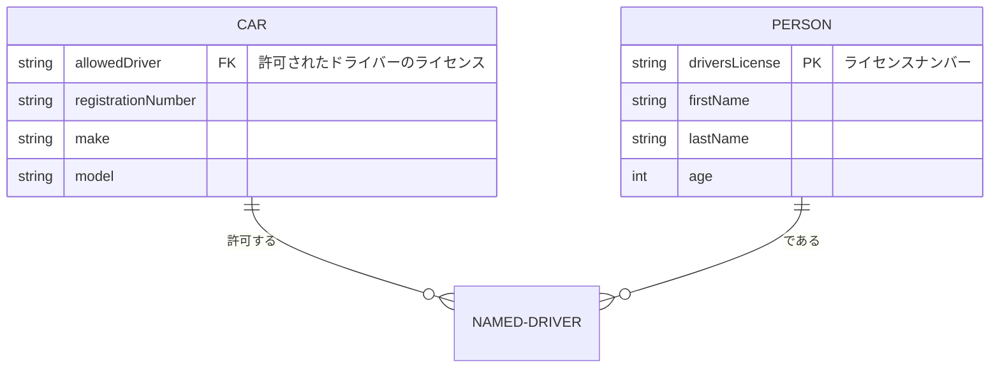

※エンティティ名は日本語にすると描画に失敗するため英語のまま

- [Entity Relationship Diagram | mermaid](https://mermaid-js.github.io/mermaid/#/entityRelationshipDiagram)

### 要件図

```
requirementDiagram
    requirement "テスト要件" {
        id: 1
        text: "テストテキスト。"
        risk: high
        verifymethod: test
    }

    element "テストエンティティ" {
        type: "シミュレーション"
    }

    "テストエンティティ" - satisfies -> "テスト要件"
```

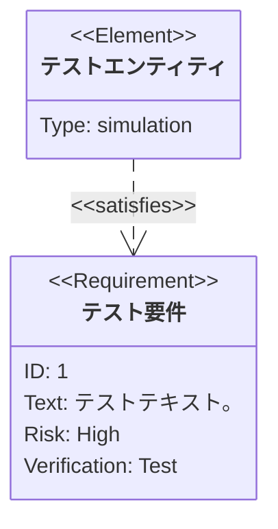

- [Requirement Diagram | mermaid](https://mermaid-js.github.io/mermaid/#/requirementDiagram)

## Mermaid 公式

- [リポジトリ](https://github.com/mermaid-js/mermaid)
- [ドキュメント](https://mermaid-js.github.io/mermaid/#/)
- [ライブエディタ](https://mermaid-js.github.io/mermaid-live-editor/)
